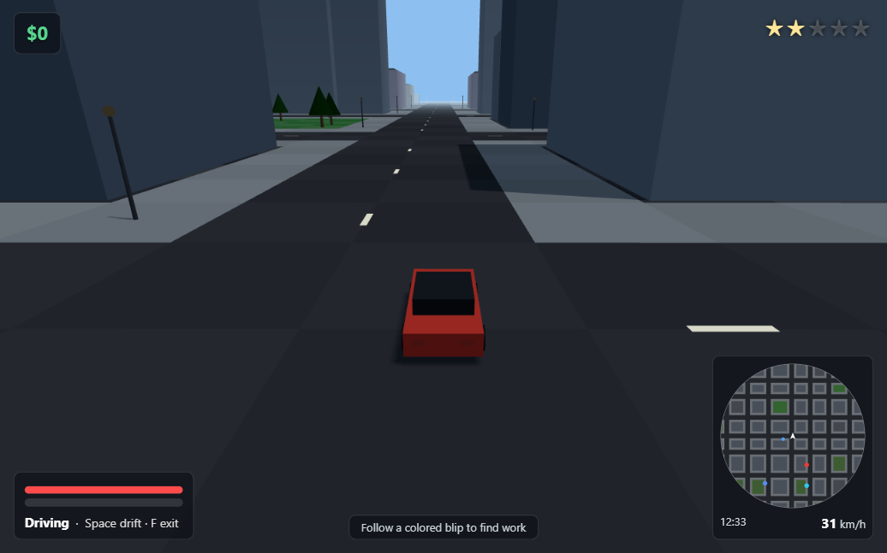
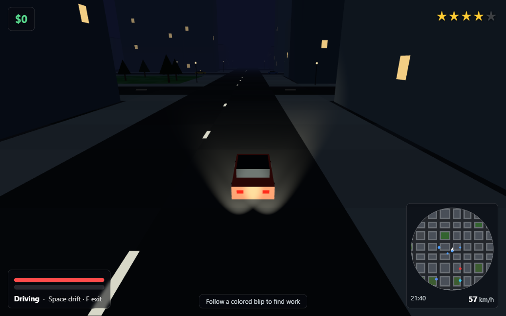
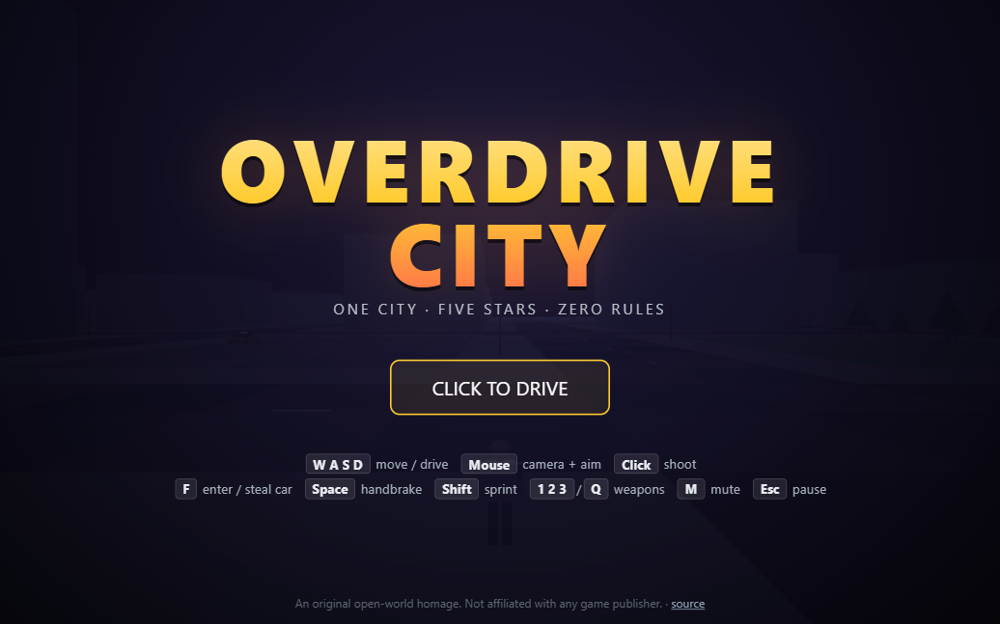
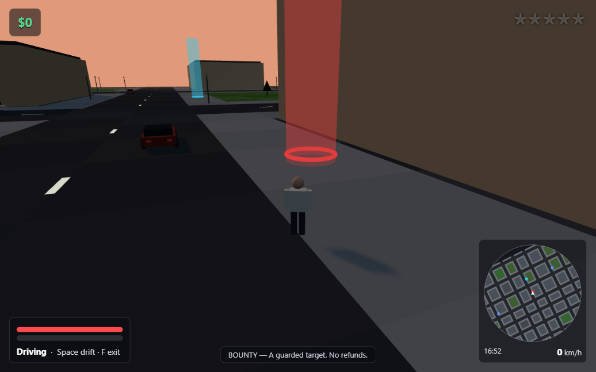

# OVERDRIVE CITY

**One city. Five stars. Zero rules.**

An original browser-based **3D open-world driving & mayhem sandbox** — steal
cars, run jobs, outdrive the law across a procedurally generated city with a
full day/night cycle. One vendored dependency, no build step, no asset files:
open `index.html` and play.

**▶ Play it now: [appleweiping.github.io/overdrive-city](https://appleweiping.github.io/overdrive-city/)**

*English · [中文说明](README.zh-CN.md)*

| | |
|---|---|
|  |  |
|  |  |

---

## What is this?

A love letter to the open-world crime genre, built from scratch as a study in
how far a browser can go with almost nothing:

- **One dependency, vendored.** [Three.js](https://threejs.org) r160 is
  checked into `lib/` — no npm, no bundler, no build step, no lockfile. Plain
  ES modules served as static files.
- **Zero asset files.** Every building, car, pedestrian and tree is generated
  geometry. Every sound — engine, gunshots, sirens, explosions, the
  mission-passed jingle — is synthesized live with the Web Audio API. The
  repo contains no images (outside docs), no models, no audio.
- **Deterministic city.** The same seed always generates the same 768 × 768 m
  city: same streets, same towers, same park. Change one number in
  [`src/config.js`](src/config.js) and you get a different town.
- **Original everything.** Original code, original name, original layout.
  The genre is the homage; nothing here is copied from any game.

## The loop

Wander the city on foot or take any car you like — parked or moving, though
the owner will object. Colored beacons scattered across the map offer **ten
kinds of procedurally generated work**: honest-ish deliveries, taxi fares,
time trials and drift contracts on the tame end; car theft to order, decoy
getaways and bounties on the other. Crime pays — but crime is *loud*:

- Crimes build **heat**; every 20 heat lights another wanted star (max 5).
- Cops respond on foot, then in cruisers, then they start **ramming**.
- Heat only decays once you've been out of every officer's line of sight for
  4 seconds — break eye contact, thread an alley, disappear.
- Get cornered standing still and you're **BUSTED** (−20% cash). Get killed
  and you're **WASTED** (−30%). Survive at 3★+ and the city pays you
  $100 every 30 seconds for the spectacle.
- Dirty money from crime missions stays **pending until you lose the heat** —
  escape is part of the job.

Your bankroll is the score. Best run is remembered locally.

## Controls

**On foot**

| Key | Action |
|---|---|
| `W A S D` | move (camera-relative) |
| `Shift` | sprint |
| mouse | orbit camera / aim |
| left click | punch / shoot |
| `1` `2` `3` / `Q` | Fists · Pistol · SMG / cycle |
| `F` / `E` / `Enter` | enter nearest car (steals it if occupied) |

**Driving**

| Key | Action |
|---|---|
| `W` / `S` | throttle / brake & reverse |
| `A` / `D` | steer |
| `Space` | handbrake — this is the drift button |
| `F` / `E` | get out (below ~30 km/h) |

**Global:** `M` mute · `Esc`/`P` pause · click to re-capture the mouse.

## The jobs

Walk or drive into a colored beacon to take the job. Every mission is
generated fresh — random targets, routes, rewards scaled by distance, wanted
risk, and time of day (night pays ×1.2).

| Beacon | Job | The deal |
|---|---|---|
| 🟡 | **COURIER** | Package, address, countdown. Speeding is encouraged; lampposts are not. |
| 🟠 | **RUSH HOUR** | 3–5 drops, one timer, any order — the route is your problem. |
| 🔵 | **GYPSY CAB** | Unlicensed taxi. Any stolen car is a cab if you're confident enough. Tips scale with speed. |
| 🟣 | **GHOST RUN** | Deliver without earning a single star. Pays double at 0★, halves per star, fails at 3★. |
| 🟢 | **BOOST** | A buyer wants *that* car, undamaged. Find it, take it, deliver it like you never touched it. |
| 🔴 | **GETAWAY** | You start at 2–4★ holding the bag. Lose the heat, then make the safehouse. |
| 🔷 | **STREET CIRCUIT** | Checkpoint time trial. Bronze pays rent, gold pays 2.2×. |
| 💗 | **SIDEWAYS** | Drift-score contract inside a marked zone. Combo multiplier up to 3×; collisions reset it. |
| 🟤 | **TURF HOLDOUT** | Hold a street corner through 3–4 waves of armed goons. Leave the zone 10 s and it's off. |
| ❤️ | **BOUNTY** | A guarded target. Bodyguards shoot back. No refunds. |

Boost, Holdout and Bounty money **banks on evade** — finish the job, then
vanish to collect.

> Tone note: civilians can't be mission targets and only ever flee; everyone
> you're paid to fight is armed and hostile. Cartoon crime, no gore.

## How it works

The whole game is ~3,500 lines of plain ES modules in [`src/`](src/), no
framework, no physics engine. The deep dive with all tuning tables lives in
[docs/DESIGN.md](docs/DESIGN.md) — highlights:

**One array runs the world.** The city generator emits a 96×96 `Uint8Array`
tile map, and that single structure backs collision (circle-vs-tile with
slide response), police line-of-sight (DDA ray-march over tiles), traffic
lanes (a direction code per road tile, right-hand rule), and mission
placement (samplable tile lists). No physics engine, no navmesh.

**The drift model is one parameter.** Each step, a car's velocity is split
into forward and lateral components; lateral speed decays as `exp(−grip·dt)`.
The handbrake just substitutes a much smaller grip constant — everything
else (the slide, the body roll, the skid marks, the drift score) falls out
of `|vL|`.

**The wanted system is a leaky bucket with eyes.** Crimes add heat (capped
per second), stars are heat ÷ 20, and decay is gated on a tile-DDA
line-of-sight check from every officer — so escaping is spatial, not a
timer. Escalation (foot → cruiser → rammer) is a per-star spawn budget.

**Ten missions, three scaffolds.** Every archetype composes the same
primitives: point-to-point runner (courier/taxi/ghost/getaway), wave spawner
(holdout, bodyguards), and watermark checks (heat ceilings, car condition,
drift combos). A new mission type is ~40 lines.

**The renderer stays out of the way.** The static city is ~10 draw calls
(merged vertex-colored ground + one `InstancedMesh` per prop family).
Particles are one preallocated 600-slot `Points` cloud; tracers are 24 pooled
lines. Simulation runs on a fixed 60 Hz accumulator so physics behave
identically on any monitor. The HUD is plain DOM — the browser's compositor
renders text and blur for free, off the WebGL budget.

**Day/night is nine keyframes.** Sky, fog, sun and ambient lerp through a
keyframe table; a `nightFactor` ramp switches on 900 pre-placed emissive
window quads, the street lamps, everyone's headlights, and two real
spotlights on your car. One shadow-casting sun follows the player with a
140 m shadow box.

```
index.html            entry — import map, HUD DOM, title screen
lib/three.module.js   the one vendored dependency (Three.js r160)
src/
  config.js           every tuning constant in the game
  rng.js              seeded RNG (mulberry32)
  city.js             tile map, districts, buildings, lanes, LOS, graph
  citymesh.js         instanced city geometry
  daynight.js         sun, fog, keyframed sky
  vehicle.js          drive model, damage, car-vs-car collisions
  traffic.js          lane-following AI, parked cars, carjacking
  peds.js             civilians, cops, gang AI, flee/hostile states
  police.js           heat, stars, LOS decay, escalation, busting
  weapons.js          hitscan combat
  missions.js         framework + 10 archetypes
  player.js           on-foot controller, enter/exit, chase camera
  effects.js          pooled particles, tracers, explosions
  audio.js            synthesized engine/siren/gunfire/jingles
  hud.js / minimap.js DOM HUD + rotating canvas minimap
  input.js / main.js  input edges + fixed-timestep game loop
```

## Run it locally

It's static files — any file server works:

```bash
git clone https://github.com/appleweiping/overdrive-city.git
cd overdrive-city
python -m http.server 8000        # or: npx serve
# open http://localhost:8000
```

(ES modules need `http://` — opening `index.html` via `file://` won't work.)

Desktop browser with a mouse recommended. WebGL2-capable GPU; it holds 60 fps
on integrated graphics and even runs ~45 fps under software rendering.

## Tinkering

Everything is a constant in [`src/config.js`](src/config.js): city size and
seed, car handling, heat values, cop budgets, weapon stats, mission economy.
Change `SEED` for a new city; drop `CAR_GRIP_HANDBRAKE` to 0.6 for
ice-rink drifting; raise `COP_CAR_MAX` if you think you're fast.

## Roadmap

- Armored cash transport & convoy intercept missions (routed AI vehicles with HP)
- Traffic lights and smarter intersections
- Gamepad support; touch controls for mobile
- Stunt-bail out of moving cars
- Ghost replays for street circuits
- A river and bridges (the map generator wants waterfront)

## License & disclaimer

[MIT](LICENSE). OVERDRIVE CITY is an **original, non-commercial fan homage to
the open-world driving genre**. It is not affiliated with, endorsed by, or
connected to Rockstar Games, Take-Two Interactive, or any other publisher.
No assets, names, characters, maps, music, or code from any commercial game
are used.
